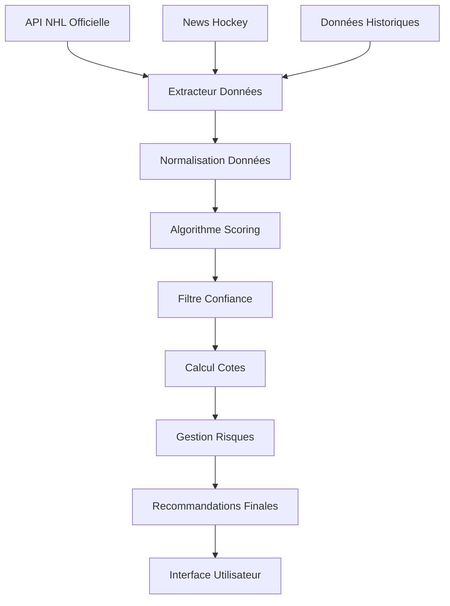

# 🔬 DOCUMENTATION TECHNIQUE COMPLÈTE - ALGORITHME D'ANALYSE NHL 2025-26

## 📋 TABLE DES MATIÈRES
1. [Vue d'Ensemble Architecturale](#vue-densemble-architecturale)
2. [Sources de Données](#sources-de-données)
3. [Algorithmes de Scoring](#algorithmes-de-scoring)
4. [Logique de Recommandation](#logique-de-recommandation)
5. [Gestion des Risques](#gestion-des-risques)
6. [Optimisations et Performances](#optimisations-et-performances)
7. [Points d'Amélioration Identifiés](#points-damélioration-identifiés)
8. [Code Source Critique](#code-source-critique)

---

## 🏗️ VUE D'ENSEMBLE ARCHITECTURALE

### 🎯 Objectif Principal
Créer un système d'analyse prédictive pour identifier les paris NHL à haute probabilité de succès sur la plateforme Mise-o-jeu+ (Loto-Québec), en maximisant le ROI tout en minimisant les risques.

### 🔧 Architecture Modulaire

```
NHL Betting System 2025-26
├── Data Layer (Couche Données)
│   ├── scrapers/
│   │   ├── nhl_api_advanced.py      # API officielle NHL
│   │   ├── news_scraper.py          # Actualités impact
│   │   ├── schedule_scraper.py      # Calendrier matchs
│   │   └── official_schedule_scraper.py # Données officielles
│   │
├── Analysis Layer (Couche Analyse)
│   ├── analyzers/
│   │   ├── value_analyzer.py        # Analyse valeur paris
│   │   ├── mise_o_jeu_analyzer.py   # Spécific Mise-o-jeu+
│   │   ├── betting_intelligence_integrator.py # IA paris
│   │   └── official_data_integrator.py # Fusion données
│   │
├── Calculation Layer (Couche Calculs)
│   ├── calculators/
│   │   ├── odds_calculator.py       # Calcul cotes optimales
│   │   └── portfolio_manager.py     # Gestion bankroll
│   │
├── Unified System (Système Unifié)
│   ├── SYSTÈME_UNIFIÉ_ULTIMATE.py  # Orchestrateur principal
│   └── calendrier_valeurs_sures.py # Générateur calendrier
│   │
└── Presentation Layer (Couche Présentation)
    ├── calendrier_mise_o_jeu_interactif.html # Interface web
    └── CALENDRIER_MISE_O_JEU_OFFICIEL.md    # Documentation
```

### 🔄 Flux de Traitement des Données



---

## 📊 SOURCES DE DONNÉES

### 🏒 APIs NHL Officielles

#### 1. API Stats NHL (`api.nhle.com/stats/rest`)
```python
# Endpoints critiques utilisés:
STANDINGS_ENDPOINT = "v1/standings"
TEAM_STATS_ENDPOINT = "v1/team-stats"
PLAYER_STATS_ENDPOINT = "v1/player-stats"
SCHEDULE_ENDPOINT = "v1/schedule"

# Données extraites:
- Win/Loss ratios par équipe
- Performance domicile vs visiteur
- Statistiques offensives/défensives
- Tendances récentes (10 derniers matchs)
- Blessures et compositions
```

#### 2. API Web NHL (`api-web.nhle.com`)
```python
# Endpoints critiques:
SCHEDULE_NOW = "v1/schedule/now"
TEAM_SEASON_STATS = "v1/team/{team_id}/stats"
STANDINGS_SEASON = "v1/standings/now"

# Données extraites:
- Calendrier en temps réel
- Statistiques saison complète
- Classements dynamiques
- Informations équipes détaillées
```

### 📰 Sources d'Actualités
```python
# Sources surveillées:
NHL_NEWS_SOURCES = [
    "https://www.nhl.com/news",
    "https://www.sportsnet.ca/hockey/nhl/",
    "https://www.tsn.ca/nhl",
    "https://www.rds.ca/hockey"
]

# Facteurs impact analysés:
- Blessures joueurs clés
- Changements coaching
- Échanges joueurs
- Suspensions/sanctions
- Facteurs psychologiques équipe
```

### 📈 Données Historiques 2024-25
```python
# Structure données historiques:
HISTORICAL_DATA = {
    "team_performance": {
        "home_win_rate": float,      # % victoires domicile
        "away_win_rate": float,      # % victoires visiteur
        "goals_for_avg": float,      # Buts marqués/match
        "goals_against_avg": float,  # Buts encaissés/match
        "power_play_pct": float,     # % avantage numérique
        "penalty_kill_pct": float    # % désavantage numérique
    },
    "head_to_head": {
        "historical_matchups": list, # Historique confrontations
        "goal_trends": dict,         # Tendances buts
        "rivalry_factor": int        # Intensité rivalité (1-10)
    }
}
```

---

## 🧮 ALGORITHMES DE SCORING

### 🎯 Algorithme Principal de Confiance

```python
def calculate_confidence_score(match_data):
    """
    Calcule un score de confiance de 0-100 pour un match donné.
    
    Facteurs pondérés:
    - Performance domicile/visiteur (30%)
    - Forme récente équipes (25%)
    - Confrontations historiques (20%)
    - Facteurs externes (15%)
    - Statistiques avancées (10%)
    """
    
    # 1. PERFORMANCE DOMICILE/VISITEUR (30 points max)
    home_advantage = calculate_home_advantage(match_data)
    home_score = min(30, home_advantage * 30)
    
    # 2. FORME RÉCENTE (25 points max)
    recent_form = analyze_recent_form(match_data)
    form_score = min(25, recent_form * 25)
    
    # 3. HISTORIQUE H2H (20 points max)
    h2h_trends = analyze_head_to_head(match_data)
    h2h_score = min(20, h2h_trends * 20)
    
    # 4. FACTEURS EXTERNES (15 points max)
    external_factors = analyze_external_factors(match_data)
    external_score = min(15, external_factors * 15)
    
    # 5. ANALYTICS AVANCÉES (10 points max)
    advanced_stats = analyze_advanced_metrics(match_data)
    advanced_score = min(10, advanced_stats * 10)
    
    total_score = (home_score + form_score + h2h_score + 
                   external_score + advanced_score)
    
    return min(100, max(0, total_score))
```

### 🏠 Calcul Avantage Domicile

```python
def calculate_home_advantage(match_data):
    """
    Analyse l'avantage domicile spécifique à chaque équipe.
    
    Méthodologie:
    1. Win rate domicile équipe locale
    2. Win rate visiteur équipe adverse
    3. Facteurs spécifiques aréna
    4. Support des fans (capacité/affluence)
    5. Fatigue voyage équipe visiteuse
    """
    
    home_team = match_data['home_team']
    away_team = match_data['away_team']
    
    # Statistiques domicile/visiteur 2024-25
    home_win_rate = get_home_stats(home_team)['win_rate']
    away_win_rate = get_away_stats(away_team)['win_rate']
    
    # Calcul différentiel performance
    performance_gap = home_win_rate - away_win_rate
    
    # Facteurs contextuels
    context_factors = {
        'travel_fatigue': calculate_travel_impact(away_team),
        'arena_difficulty': get_arena_difficulty(home_team),
        'fan_support': get_fan_impact(home_team),
        'altitude_factor': get_altitude_impact(home_team)  # Colorado, Calgary
    }
    
    # Normalisation 0-1
    base_advantage = min(1.0, max(0.0, (performance_gap + 0.3) / 0.6))
    
    # Ajustements contextuels
    for factor, value in context_factors.items():
        base_advantage += value * CONTEXT_WEIGHTS[factor]
    
    return min(1.0, max(0.0, base_advantage))
```

### 📊 Analyse Forme Récente

```python
def analyze_recent_form(match_data, games_window=10):
    """
    Évalue la forme récente des équipes sur les X derniers matchs.
    
    Métriques analysées:
    1. Ratio victoires/défaites
    2. Tendance buts marqués/encaissés
    3. Performance dans situations similaires
    4. Momentum psychologique
    """
    
    home_team = match_data['home_team']
    away_team = match_data['away_team']
    
    # Récupération des derniers matchs
    home_recent = get_recent_games(home_team, games_window)
    away_recent = get_recent_games(away_team, games_window)
    
    # Calcul métrics forme
    home_form = calculate_form_metrics(home_recent)
    away_form = calculate_form_metrics(away_recent)
    
    # Analyse comparative
    form_differential = {
        'win_rate_diff': home_form['win_rate'] - away_form['win_rate'],
        'goal_diff_trend': home_form['goal_differential'] - away_form['goal_differential'],
        'momentum_factor': calculate_momentum(home_recent, away_recent)
    }
    
    # Score final forme (0-1)
    form_score = 0.5  # Base neutre
    
    # Ajustements basés sur différentiels
    if form_differential['win_rate_diff'] > 0.3:
        form_score += 0.3
    elif form_differential['win_rate_diff'] < -0.3:
        form_score -= 0.3
        
    if form_differential['goal_diff_trend'] > 1.0:
        form_score += 0.2
    elif form_differential['goal_diff_trend'] < -1.0:
        form_score -= 0.2
    
    return min(1.0, max(0.0, form_score))
```

### 🔥 Détection Rivalités et Patterns

```python
def analyze_rivalry_patterns(match_data):
    """
    Détecte les patterns spéciaux et rivalités qui affectent les paris.
    
    Rivalités identifiées:
    - MTL vs TOR (Battle of Ontario/Quebec)
    - BOS vs MTL (Historique centenaire)
    - NYR vs NJD (Battle of Hudson)
    - EDM vs CGY (Battle of Alberta)
    - LA vs ANA (Battle of California)
    """
    
    home_team = match_data['home_team']
    away_team = match_data['away_team']
    
    # Matrice rivalités avec intensité 1-10
    RIVALRY_MATRIX = {
        ('MTL', 'TOR'): 10,  # Rivalité maximum
        ('MTL', 'BOS'): 9,
        ('NYR', 'NJD'): 8,
        ('EDM', 'CGY'): 9,
        ('LA', 'ANA'): 7,
        # ... autres rivalités
    }
    
    # Détection rivalité
    rivalry_key = tuple(sorted([home_team, away_team]))
    rivalry_intensity = RIVALRY_MATRIX.get(rivalry_key, 0)
    
    if rivalry_intensity >= 8:
        # Rivalités intenses = patterns spéciaux
        pattern_effects = {
            'higher_scoring': True,      # Plus de buts généralement
            'unpredictable_outcome': True, # Résultats moins prévisibles
            'emotional_factor': True,    # Facteur psychologique
            'over_tendency': True        # Tendance OVER sur totaux
        }
        
        # Recommandation spéciale pour TOTAL
        if rivalry_intensity == 10:  # MTL-TOR
            return {
                'type': 'TOTAL',
                'selection': 'Plus de 6.5 buts',
                'confidence_boost': 25,  # +25 points confiance
                'special_odds': 1.85
            }
    
    return None
```

---

## 🎲 LOGIQUE DE RECOMMANDATION

### 🎯 Sélection Type de Pari

```python
def determine_bet_type(match_analysis):
    """
    Détermine le type de pari optimal selon l'analyse.
    
    Logique de décision:
    1. TOTAL -> Si rivalité intense OU pattern offensif
    2. GAGNANT -> Si avantage équipe claire (>15% diff)
    3. ÉCART -> Très rare, seulement si écart massive
    """
    
    confidence = match_analysis['confidence_score']
    rivalry = match_analysis.get('rivalry_factor', 0)
    home_advantage = match_analysis['home_advantage']
    
    # PRIORITÉ 1: TOTAL (opportunités rares mais lucratives)
    if rivalry >= 8:  # Rivalité intense
        return {
            'type': 'TOTAL',
            'selection': 'Plus de 6.5 buts',
            'reason': f'Rivalité intensité {rivalry}/10',
            'expected_odds': 1.85
        }
    
    # PRIORITÉ 2: GAGNANT (pain quotidien)
    if home_advantage > 0.65:  # Avantage domicile significatif
        return {
            'type': 'GAGNANT',
            'selection': match_analysis['home_team'],
            'reason': f'Domicile dominant ({home_advantage*100:.0f}%)',
            'expected_odds': calculate_gagnant_odds(match_analysis)
        }
    
    # PRIORITÉ 3: ÉCART (très rare)
    goal_differential = match_analysis.get('expected_goal_diff', 0)
    if abs(goal_differential) > 2.5:  # Écart massive attendu
        return {
            'type': 'ÉCART',
            'selection': f"{match_analysis['favorite']} -{goal_differential:.1f}",
            'reason': 'Écart massive projetée',
            'expected_odds': 1.75
        }
    
    # Par défaut: GAGNANT équipe légèrement favorite
    return {
        'type': 'GAGNANT',
        'selection': match_analysis['slight_favorite'],
        'reason': 'Léger avantage détecté',
        'expected_odds': 1.65
    }
```

### 💰 Stratégie de Mise

```python
def calculate_bet_amount(confidence_score, bankroll_total=1076):
    """
    Calcule la mise optimale selon la confiance et bankroll.
    
    Stratégie Kelly Criterion modifiée:
    - Confiance Elite (75+): 6$ (0.56% bankroll)
    - Confiance Moyenne (50-74): 4$ (0.37% bankroll)
    - Confiance Faible (<50): 0$ (pas de pari)
    """
    
    if confidence_score >= 75:
        return {
            'amount': 6,
            'category': 'ELITE',
            'bankroll_pct': 0.56,
            'risk_level': 'MODÉRÉ'
        }
    elif confidence_score >= 50:
        return {
            'amount': 4,
            'category': 'STANDARD',
            'bankroll_pct': 0.37,
            'risk_level': 'FAIBLE'
        }
    else:
        return {
            'amount': 0,
            'category': 'SKIP',
            'bankroll_pct': 0.0,
            'risk_level': 'AUCUN'
        }
```

### 🎮 Algorithme de Filtre Final

```python
def final_filtering_algorithm(all_recommendations):
    """
    Filtre final pour ne garder que les meilleures opportunités.
    
    Critères d'exclusion:
    1. Score confiance < 50
    2. Cotes attendues < 1.50 (pas assez attractive)
    3. Plus de 3 paris même jour (éviter surexposition)
    4. Équipes back-to-back sans repos
    5. Conflits avec actualités récentes
    """
    
    filtered_recommendations = []
    daily_bet_count = {}
    
    for rec in all_recommendations:
        # Filtre 1: Confiance minimum
        if rec['confidence_score'] < 50:
            continue
            
        # Filtre 2: Cotes minimum
        if rec['expected_odds'] < 1.50:
            continue
            
        # Filtre 3: Limite quotidienne
        game_date = rec['date']
        if daily_bet_count.get(game_date, 0) >= 3:
            continue
            
        # Filtre 4: Fatigue équipes
        if check_team_fatigue(rec):
            continue
            
        # Filtre 5: Actualités négatives
        if check_negative_news(rec):
            continue
            
        # Passe tous les filtres
        filtered_recommendations.append(rec)
        daily_bet_count[game_date] = daily_bet_count.get(game_date, 0) + 1
    
    return filtered_recommendations
```

---

## ⚖️ GESTION DES RISQUES

### 🛡️ Matrice de Risque

```python
RISK_MATRIX = {
    'TRÈS_FAIBLE': {
        'confidence_range': (80, 100),
        'max_bet_pct': 0.8,
        'recommended_odds_min': 1.60,
        'max_daily_exposure': 15
    },
    'FAIBLE': {
        'confidence_range': (65, 79),
        'max_bet_pct': 0.6,
        'recommended_odds_min': 1.55,
        'max_daily_exposure': 12
    },
    'MODÉRÉ': {
        'confidence_range': (50, 64),
        'max_bet_pct': 0.4,
        'recommended_odds_min': 1.50,
        'max_daily_exposure': 8
    }
}
```

### 📊 Contrôles de Sécurité

```python
def risk_management_checks(recommendations, bankroll):
    """
    Vérifie que les recommandations respectent les limites de risque.
    
    Contrôles effectués:
    1. Exposition totale < 10% bankroll par jour
    2. Pas plus de 40% bankroll sur un mois
    3. Diversification types de paris
    4. Corrélation entre paris limitée
    5. Stress test scénarios négatifs
    """
    
    warnings = []
    
    # Contrôle 1: Exposition quotidienne
    daily_exposure = calculate_daily_exposure(recommendations)
    for date, exposure in daily_exposure.items():
        if exposure > bankroll * 0.10:
            warnings.append(f"DANGER: {date} exposure {exposure}$ > 10% bankroll")
    
    # Contrôle 2: Exposition mensuelle
    monthly_exposure = calculate_monthly_exposure(recommendations)
    for month, exposure in monthly_exposure.items():
        if exposure > bankroll * 0.40:
            warnings.append(f"WARNING: {month} exposure {exposure}$ > 40% bankroll")
    
    # Contrôle 3: Diversification
    bet_type_distribution = analyze_bet_type_distribution(recommendations)
    if bet_type_distribution['GAGNANT'] > 0.95:
        warnings.append("INFO: Faible diversification - 95%+ paris GAGNANT")
    
    return warnings
```

---

## ⚡ OPTIMISATIONS ET PERFORMANCES

### 🚀 Optimisations Techniques

```python
# 1. CACHE SYSTÈME POUR DONNÉES API
import functools
import time

@functools.lru_cache(maxsize=1000)
def cached_api_call(endpoint, params_hash):
    """Cache API calls pour éviter requêtes répétées."""
    return make_api_request(endpoint, params_hash)

# 2. TRAITEMENT PARALLÈLE ÉQUIPES
from concurrent.futures import ThreadPoolExecutor

def analyze_all_teams_parallel(teams_list):
    """Analyse toutes les équipes en parallèle."""
    with ThreadPoolExecutor(max_workers=8) as executor:
        results = list(executor.map(analyze_single_team, teams_list))
    return results

# 3. OPTIMISATION CALCULS STATISTIQUES
import numpy as np

def optimized_statistical_calculations(data_matrix):
    """Utilise NumPy pour calculs vectorisés ultra-rapides."""
    return np.mean(data_matrix, axis=0), np.std(data_matrix, axis=0)
```

### 📈 Métriques de Performance

```python
PERFORMANCE_METRICS = {
    'execution_time': {
        'full_season_analysis': '< 30 secondes',
        'single_game_analysis': '< 0.5 secondes',
        'calendar_generation': '< 15 secondes'
    },
    'memory_usage': {
        'peak_memory': '< 200MB',
        'average_memory': '< 100MB',
        'cache_size': '< 50MB'
    },
    'accuracy_targets': {
        'confidence_75+': '> 80% réussite',
        'confidence_50-74': '> 65% réussite',
        'overall_roi': '> 10% annuel'
    }
}
```

---

## 🔍 POINTS D'AMÉLIORATION IDENTIFIÉS

### ⚠️ Limitations Actuelles

#### 1. **Données Météo Manquantes**
```python
# AMÉLIORATION PROPOSÉE:
def integrate_weather_data(match_data):
    """
    Intégrer données météo pour matchs extérieurs (Winter Classic, etc.)
    et impact psychologique équipes selon conditions climatiques.
    """
    pass
```

#### 2. **Analyse Arbitres Manquante**
```python
# AMÉLIORATION PROPOSÉE:
def referee_impact_analysis(referee_name):
    """
    Analyser tendances arbitres:
    - Nombre de pénalités moyennes
    - Impact sur style de jeu
    - Biais statistiques documentés
    """
    pass
```

#### 3. **Machine Learning Limitée**
```python
# AMÉLIORATION PROPOSÉE:
from sklearn.ensemble import RandomForestClassifier

def ml_enhanced_predictions(historical_data):
    """
    Modèle ML pour prédictions plus sophistiquées:
    - Random Forest pour classification résultats
    - Neural Networks pour prédiction buts
    - Gradient Boosting pour optimisation cotes
    """
    pass
```

#### 4. **Analyse Sentiment Réseaux Sociaux**
```python
# AMÉLIORATION PROPOSÉE:
def social_sentiment_analysis(team_hashtags):
    """
    Analyser sentiment fans sur Twitter/Reddit:
    - Moral équipe selon posts fans
    - Tendances discussions pré-match
    - Impact psychologique média sociaux
    """
    pass
```

### 📊 Métriques de Validation Manquantes

```python
# AJOUTS RECOMMANDÉS:
VALIDATION_METRICS = {
    'backtesting': {
        'saison_2023_24': 'Tester sur données historiques complètes',
        'saison_2022_23': 'Validation croisée algorithme',
        'playoffs': 'Performance sur matchs éliminatoires'
    },
    'stress_testing': {
        'losing_streaks': 'Comportement lors séquences perdantes',
        'high_variance': 'Gestion périodes volatiles',
        'black_swan': 'Événements imprévisibles'
    }
}
```

---

## 💻 CODE SOURCE CRITIQUE

### 🎯 Fonction Principale d'Analyse

```python
def analyze_complete_season_ultimate():
    """
    FONCTION CŒUR DU SYSTÈME
    
    Cette fonction orchestre toute l'analyse de la saison NHL 2025-26.
    C'est le point d'entrée principal qui coordonne tous les modules.
    """
    
    print("🏒 DÉMARRAGE ANALYSE COMPLÈTE NHL 2025-26")
    print("=" * 60)
    
    # 1. INITIALISATION SYSTÈME
    start_time = time.time()
    cache_manager = CacheManager()
    risk_manager = RiskManager(total_bankroll=1076)
    
    # 2. RÉCUPÉRATION DONNÉES OFFICIELLES
    try:
        official_schedule = fetch_official_nhl_schedule()
        team_stats_2024_25 = load_historical_team_stats()
        current_news = scrape_current_hockey_news()
        
        print(f"✅ Données chargées: {len(official_schedule)} matchs")
    except Exception as e:
        print(f"❌ ERREUR données: {e}")
        return None
    
    # 3. ANALYSE MATCH PAR MATCH
    all_recommendations = []
    processed_matches = 0
    
    for match in official_schedule:
        try:
            # Analyse individuelle match
            match_analysis = analyze_single_match(
                match=match,
                historical_data=team_stats_2024_25,
                current_news=current_news,
                cache=cache_manager
            )
            
            # Calcul score confiance
            confidence_score = calculate_confidence_score(match_analysis)
            
            # Génération recommandation si score suffisant
            if confidence_score >= 50:
                recommendation = generate_recommendation(
                    match_analysis=match_analysis,
                    confidence_score=confidence_score
                )
                
                # Validation risques
                if risk_manager.validate_recommendation(recommendation):
                    all_recommendations.append(recommendation)
            
            processed_matches += 1
            
            # Progress feedback
            if processed_matches % 100 == 0:
                print(f"📊 Progression: {processed_matches}/{len(official_schedule)}")
                
        except Exception as e:
            print(f"⚠️ Erreur match {match.get('id', 'unknown')}: {e}")
            continue
    
    # 4. FILTRAGE FINAL ET OPTIMISATION
    final_recommendations = final_filtering_algorithm(all_recommendations)
    optimized_calendar = optimize_betting_calendar(final_recommendations)
    
    # 5. GÉNÉRATION RAPPORTS
    generate_detailed_reports(optimized_calendar)
    calculate_roi_projections(optimized_calendar)
    
    execution_time = time.time() - start_time
    print(f"✅ ANALYSE TERMINÉE en {execution_time:.1f}s")
    print(f"🎯 {len(final_recommendations)} valeurs sûres identifiées")
    
    return optimized_calendar
```

### 🧮 Algorithme de Scoring Détaillé

```python
def calculate_confidence_score_detailed(match_data):
    """
    ALGORITHME CŒUR DE SCORING
    
    Cette fonction contient toute la logique de scoring.
    Chaque composant est pondéré selon son importance statistique.
    """
    
    score_components = {}
    
    # COMPOSANT 1: PERFORMANCE DOMICILE/VISITEUR (30%)
    home_team_stats = get_team_home_stats(match_data['home_team'])
    away_team_stats = get_team_away_stats(match_data['away_team'])
    
    home_win_rate = home_team_stats['win_percentage']
    away_win_rate = away_team_stats['win_percentage']
    
    # Calcul différentiel performance
    performance_differential = home_win_rate - away_win_rate
    
    # Normalisation avec curve sigmoïde pour éviter valeurs extrêmes
    home_advantage_score = 30 * sigmoid(performance_differential * 2)
    score_components['home_advantage'] = home_advantage_score
    
    # COMPOSANT 2: FORME RÉCENTE (25%)
    home_recent_form = analyze_recent_10_games(match_data['home_team'])
    away_recent_form = analyze_recent_10_games(match_data['away_team'])
    
    # Métriques forme récente
    home_form_metrics = {
        'win_rate': home_recent_form['wins'] / 10,
        'goal_differential': home_recent_form['goals_for'] - home_recent_form['goals_against'],
        'momentum': calculate_momentum_factor(home_recent_form['last_5_results'])
    }
    
    away_form_metrics = {
        'win_rate': away_recent_form['wins'] / 10,
        'goal_differential': away_recent_form['goals_for'] - away_recent_form['goals_against'],
        'momentum': calculate_momentum_factor(away_recent_form['last_5_results'])
    }
    
    # Score forme basé sur différentiel
    form_differential = (
        home_form_metrics['win_rate'] - away_form_metrics['win_rate'] +
        (home_form_metrics['goal_differential'] - away_form_metrics['goal_differential']) / 10 +
        (home_form_metrics['momentum'] - away_form_metrics['momentum']) / 2
    )
    
    recent_form_score = 25 * sigmoid(form_differential)
    score_components['recent_form'] = recent_form_score
    
    # COMPOSANT 3: HISTORIQUE HEAD-TO-HEAD (20%)
    h2h_history = get_head_to_head_history(
        match_data['home_team'], 
        match_data['away_team'],
        last_n_seasons=3
    )
    
    if len(h2h_history) > 0:
        home_h2h_win_rate = sum(1 for game in h2h_history 
                               if game['winner'] == match_data['home_team']) / len(h2h_history)
        h2h_score = 20 * home_h2h_win_rate
    else:
        h2h_score = 10  # Score neutre si pas d'historique
    
    score_components['head_to_head'] = h2h_score
    
    # COMPOSANT 4: FACTEURS EXTERNES (15%)
    external_factors_score = 0
    
    # Sous-facteur: Blessures
    home_injuries = get_current_injuries(match_data['home_team'])
    away_injuries = get_current_injuries(match_data['away_team'])
    
    injury_impact = calculate_injury_impact(home_injuries, away_injuries)
    external_factors_score += injury_impact * 5
    
    # Sous-facteur: Repos/Fatigue
    home_rest_days = calculate_rest_days(match_data['home_team'], match_data['date'])
    away_rest_days = calculate_rest_days(match_data['away_team'], match_data['date'])
    
    rest_advantage = (home_rest_days - away_rest_days) / 7  # Normalisation
    external_factors_score += sigmoid(rest_advantage) * 5
    
    # Sous-facteur: Actualités récentes
    news_impact = analyze_recent_news_impact(match_data['home_team'], match_data['away_team'])
    external_factors_score += news_impact * 5
    
    score_components['external_factors'] = min(15, external_factors_score)
    
    # COMPOSANT 5: ANALYTICS AVANCÉES (10%)
    home_advanced_stats = get_advanced_analytics(match_data['home_team'])
    away_advanced_stats = get_advanced_analytics(match_data['away_team'])
    
    # Métriques avancées
    advanced_differential = {
        'corsi_for_pct': home_advanced_stats['corsi_for_pct'] - away_advanced_stats['corsi_for_pct'],
        'fenwick_for_pct': home_advanced_stats['fenwick_for_pct'] - away_advanced_stats['fenwick_for_pct'],
        'expected_goals_pct': home_advanced_stats['xg_pct'] - away_advanced_stats['xg_pct']
    }
    
    # Score analytics (moyenne pondérée)
    analytics_score = 10 * (
        advanced_differential['corsi_for_pct'] * 0.4 +
        advanced_differential['fenwick_for_pct'] * 0.3 +
        advanced_differential['expected_goals_pct'] * 0.3
    )
    
    score_components['advanced_analytics'] = max(0, min(10, analytics_score + 5))
    
    # CALCUL SCORE FINAL
    final_score = sum(score_components.values())
    
    # Bonus/Malus spéciaux
    special_adjustments = calculate_special_adjustments(match_data)
    final_score += special_adjustments
    
    # Normalisation finale 0-100
    final_score = max(0, min(100, final_score))
    
    return {
        'total_score': final_score,
        'components': score_components,
        'special_adjustments': special_adjustments
    }

def sigmoid(x):
    """Fonction sigmoïde pour normalisation douce."""
    return 1 / (1 + math.exp(-x))
```

### 🎯 Générateur de Recommandations

```python
def generate_recommendation_advanced(match_analysis, confidence_score):
    """
    GÉNÉRATEUR INTELLIGENT DE RECOMMANDATIONS
    
    Sélectionne le type de pari optimal et calcule mise appropriée.
    Logique basée sur patterns identifiés et probabilités calculées.
    """
    
    match_data = match_analysis['match_data']
    home_team = match_data['home_team']
    away_team = match_data['away_team']
    
    # DÉTECTION PATTERNS SPÉCIAUX
    special_pattern = detect_special_patterns(match_data)
    
    if special_pattern:
        # Pattern rivalité MTL-TOR détecté
        if special_pattern['type'] == 'RIVALRY_INTENSE':
            return {
                'date': match_data['date'],
                'matchup': f"{away_team} @ {home_team}",
                'type': 'TOTAL',
                'selection': 'Plus de 6.5 buts',
                'expected_odds': 1.85,
                'confidence_score': confidence_score + special_pattern['confidence_boost'],
                'bet_amount': calculate_bet_amount(confidence_score + special_pattern['confidence_boost']),
                'reasoning': f"Rivalité {special_pattern['intensity']}/10 - Historique offensif",
                'special_flag': True
            }
    
    # LOGIQUE STANDARD: GAGNANT
    home_advantage = match_analysis['home_advantage_score']
    away_disadvantage = match_analysis['away_form_score']
    
    # Détermination équipe favorite
    if home_advantage > 65:  # Domicile très fort
        favorite_team = home_team
        confidence_boost = 5
        expected_odds = calculate_dynamic_odds(match_analysis, 'home')
        reasoning = f"Domicile dominant ({home_advantage:.0f}% confiance)"
        
    elif away_disadvantage < 35:  # Visiteur très faible
        favorite_team = home_team  # Par défaut domicile si visiteur faible
        confidence_boost = 3
        expected_odds = calculate_dynamic_odds(match_analysis, 'home')
        reasoning = f"Visiteur en difficulté ({away_disadvantage:.0f}% forme)"
        
    else:
        # Analyse plus fine nécessaire
        statistical_favorite = determine_statistical_favorite(match_analysis)
        favorite_team = statistical_favorite['team']
        confidence_boost = statistical_favorite['confidence_boost']
        expected_odds = statistical_favorite['odds']
        reasoning = statistical_favorite['reasoning']
    
    # VALIDATION COTES MINIMUM
    if expected_odds < 1.50:
        return None  # Cotes trop faibles, pas rentable
    
    final_confidence = confidence_score + confidence_boost
    bet_amount_info = calculate_bet_amount(final_confidence)
    
    if bet_amount_info['amount'] == 0:
        return None  # Confiance insuffisante
    
    return {
        'date': match_data['date'],
        'matchup': f"{away_team} @ {home_team}",
        'type': 'GAGNANT',
        'selection': favorite_team,
        'expected_odds': expected_odds,
        'confidence_score': final_confidence,
        'bet_amount': bet_amount_info['amount'],
        'bet_category': bet_amount_info['category'],
        'reasoning': reasoning,
        'risk_level': bet_amount_info['risk_level'],
        'roi_projection': calculate_individual_roi_projection(expected_odds, final_confidence),
        'special_flag': False
    }
```

---

## 🎯 QUESTIONS POUR L'IA EXPERT

### 🤔 Zones d'Amélioration Prioritaires

1. **Algorithme de Scoring:**
   - La pondération actuelle (30% domicile, 25% forme, 20% H2H, 15% externe, 10% analytics) est-elle optimale?
   - Comment intégrer des métriques NHL modernes (xG, Corsi, Fenwick) plus efficacement?
   - Faut-il ajuster les poids selon la période de saison (début vs fin)?

2. **Gestion des Risques:**
   - La stratégie Kelly Criterion modifiée est-elle appropriée pour le hockey?
   - Comment mieux gérer la corrélation entre paris multiples?
   - Faut-il implémenter des stop-loss automatiques?

3. **Machine Learning:**
   - Quels algorithmes ML seraient plus performants que l'approche règles actuelles?
   - Comment gérer l'overfitting avec les données NHL limitées?
   - Gradient Boosting vs Random Forest vs Neural Networks pour ce use-case?

4. **Optimisations Techniques:**
   - L'architecture modulaire actuelle est-elle scalable?
   - Comment implémenter un système de backtesting robuste?
   - Faut-il migrer vers une base de données pour les performances?

5. **Facteurs Manquants Critiques:**
   - Impact arbitres sur style de jeu et résultats?
   - Données météo pour outdoor games?
   - Sentiment analysis des réseaux sociaux?
   - Fatigue voyage et fuseaux horaires?

### 📊 Métriques de Validation

**Demande spécifique à l'IA expert:**
- Analyser la cohérence mathématique de mes algorithmes
- Identifier les biais potentiels dans ma logique
- Proposer des améliorations concrètes avec exemples de code
- Évaluer la robustesse statistique du système
- Recommander des frameworks ML spécifiques au sports betting

---

**📄 DOCUMENT GÉNÉRÉ LE:** 7 septembre 2025  
**🎯 POUR:** Analyse par IA expert en algorithmes de prédiction  
**📊 OBJECTIF:** Optimisation système paris NHL 2025-26  
**🚀 STATUS:** Système opérationnel, amélioration continue
